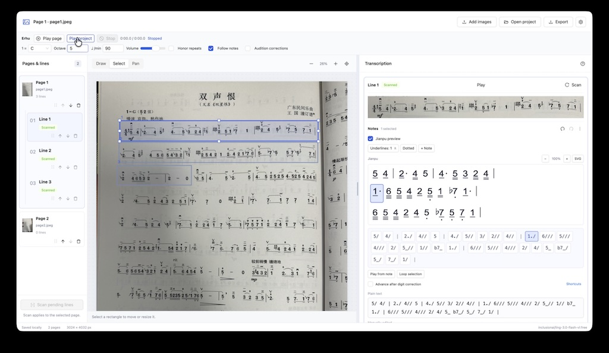

# van-jianpu

Application for drawing note-line rectangles, transcribing each crop through a vision LLM, and correcting the result beside the image.



## Run the production build

From project root folder:

```sh
npm --prefix frontend install
npm --prefix backend install
npm --prefix frontend run build
npm --prefix backend run build
npm --prefix backend start
```

Open **http://127.0.0.1:3001**. The Node.js backend serves both `/api` and `frontend/dist`, including the SPA fallback. Each package has its own `package.json`, lockfile, and `node_modules`; there is no root workspace or shared install. Use Node.js 22.12+ or 24+.

## Development

Run in two terminals from project root folder:

```sh
npm --prefix backend run dev
```

```sh
npm --prefix frontend run dev
```

Open the Vite URL shown in the terminal (normally http://127.0.0.1:5173). Vite proxies `/api` to port 3001. If changing the backend port, also update the proxy in `frontend/vite.config.ts`.

## Electron desktop app

From the project root (`codes/v4` in this workspace):

```sh
npm --prefix frontend install
npm --prefix backend install
npm --prefix desktop install
npm --prefix desktop start
```

The desktop launcher builds the frontend and backend, then opens **Van Jianpu** in Electron. No separate Node server or Vite terminal is needed. After a build, `npm --prefix desktop run start:built` launches immediately; rerun `desktop start` after changing frontend/backend code. `desktop` has its own package, lockfile, and `node_modules`, alongside the independent frontend/backend packages.

The app includes image pages, line editing, the SVG renderer, Erhu playback, LLM settings, and project exports. Image/project inputs use native file pickers; exports offer a native save dialog, and clicking a crop opens a separate image window. The File menu can open the app's data folder. Window size/position are remembered. On macOS, closing the last window keeps the app running; use Quit to exit, or click its Dock icon to reopen it.

Desktop projects and settings are stored separately from browser projects, under a stable `jianpu://scanner` origin in Electron's user-data folder. Closing/reopening the app preserves the current project even though its private backend uses a different port each launch. To move work between browser and desktop, export and import an editable `.jianpu` project (older `.jianpu.json` files still open). Only one instance uses a given desktop profile at a time.

Source launches use the existing project `.env` as a fallback. Packaged applications **do not contain that file or its credentials**. In a packaged app, configure the provider through **LLM settings**, or place a private `.env` in **File → Open app data folder** and restart. Environment variables take precedence, then the desktop data-folder `.env`, then the source `.env` for development only. Keys entered in the settings drawer still last only for the current window session. The data folder is normally `~/Library/Application Support/Van Jianpu` on macOS, `%APPDATA%/Van Jianpu` on Windows, and `~/.config/Van Jianpu` on Linux. `JIANPU_DESKTOP_DATA_DIR` can select an isolated profile for testing.

Build an unpacked application or distributable installers:

```sh
npm --prefix desktop run package
npm --prefix desktop run dist
```

Outputs go to `desktop/release/`. Targets are macOS DMG/ZIP, Windows NSIS, and Linux AppImage. Build on the target operating system and architecture so `sharp`'s native libraries match; only the current host's build is verified locally. Packaged users do not need Node.js. Local builds can be unsigned; public distribution requires the appropriate platform signing/notarization setup. These scripts never publish artifacts automatically. The initial app uses Electron's default icon.

The desktop runtime includes only compiled application assets and production dependencies; the build excludes source `.env` files, saved projects, and test fixtures. The renderer is sandboxed with Node integration disabled. A registered secure app protocol serves the UI and forwards API calls through a private authenticated loopback connection. No fixed port is required, and browser-mode serving remains unchanged. This follows Electron's [custom protocol](https://www.electronjs.org/docs/latest/api/protocol) and [renderer isolation](https://www.electronjs.org/docs/latest/tutorial/security) guidance.

## Configuration

The backend loads project root folder/.env` regardless of the working directory. Existing process environment variables take precedence. `.env.example` lists the settings; the existing `.env` was preserved.

| Variable | Purpose |
| --- | --- |
| `LLM_PROVIDER` | `openai-compatible` (the supported protocol) |
| `LLM_BASE_URL` | Provider base URL, usually ending in `/v1` |
| `LLM_MODEL` | Vision-capable model identifier |
| `LLM_API_KEY` | Backend credential |
| `LLM_MAX_TOKENS` | Maximum completion budget, default 16384 |
| `LLM_THINKING` | `auto`, `enabled`, or `disabled` |
| `HOST` / `PORT` | Listen address; defaults to `127.0.0.1:3001` |

The Settings drawer overrides the endpoint, model, and optional key. Endpoint/model persist in browser storage; a key entered in the drawer lasts only for the current page session. The server key is never returned to the browser and is never sent to a different endpoint selected in the UI. Project exports contain no LLM settings or credentials.

Requests use `POST {baseUrl}/chat/completions` with an image URL content block containing the crop as PNG. Two lines scan concurrently in the browser, with a server-wide cap of three and a 90-second provider timeout. Cancelling aborts active requests; queued lines remain available to scan.

In automatic mode, Ling 3 models use non-thinking requests and temperature 0.6. The supplied model completed the sample's digit sequence with this configuration; thinking mode exhausted a 4096-token budget in an earlier check. For other models, automatic mode leaves thinking at the provider default. Explicit overrides require provider support. Ling's template switch is documented in the [official model card](https://huggingface.co/inclusionAI/Ling-3.0-flash-VL/blob/main/README.md); the request also uses the compatible gateway `reasoning.enabled` option.

The default server is intended for local use. Set `HOST` when serving on another interface; this first version does not include accounts or authentication.

## Workflow

1. Use **Add images** to import one or more PNG, JPEG, or WebP photos (up to 20 MB / 40 megapixels each). Each image becomes a page. Further imports append pages to the current project, in file-picker order, and select the first newly added page.
2. Select a page in **Pages & lines**. In Draw mode, drag around each note line, including space for octave dots and underlines. The tool switches to Select after drawing; select Draw for the next rectangle. Lines appear nested beneath their source page.
3. Move or resize rectangles in Select mode. Use zoom controls and Pan for large images. Reorder pages or their lines with the sidebar arrows, or drag a grip onto another item to place it before that item. Lines reorder within their own page; their crop coordinates remain attached to the same image.
4. Scan pending lines on the selected page, or scan one line from its result card. You can switch pages during scanning; results return to the original page. Click a crop to open it at full size.
5. Correct the text. Rescanning preserves manual edits and displays the latest model result separately. A changed crop marks previous text as outdated.
6. Click the pencil beside the project title to **Rename project**. The name saves locally and supplies the filename for TXT, SVG, and editable `.jianpu` exports. New projects default to the first imported image’s filename; reordering pages does not change the project name.
7. Export TXT, SVG, or an editable `.jianpu` project. Text export follows page order, then line order, with a blank line between pages that contain lines; an empty line becomes `?`. The project contains all images, rectangles, order, and both edited/model text. Deleting a page also deletes its lines after confirmation.

The current project and selected page save to IndexedDB and recover after refresh or restart in the same browser and origin. Interrupted scans become retryable errors. There is one autosaved project; export it before replacing it with another project. Different development/production ports have separate browser storage.

Projects support up to 100 image pages, 200 lines per page, and 100 MB of expanded project data, including the in-memory base64 image representation. A failed image batch leaves the existing project intact. The backend API still receives one cropped line per request.

Editable `.jianpu` files are ZIP archives containing a pretty-printed `project.json` manifest (version 3) and binary files under `images/`. The manifest stores the project name, page/line order, rectangles, corrected/model text, playback settings, and image paths/dimensions; it contains no base64 image strings. Identical page images share one archive entry. Packing and reading projects run in a background worker, with an Exporting indicator while packing. Images retain their quality and resolution; newly imported JPEGs keep their original bytes, including orientation metadata, instead of expanding into PNG.

To inspect a project outside the app, make a copy, change its extension to `.zip`, and unzip it. Open `project.json` to read the notes without making your editor or Quick Look parse embedded image data. Export TXT when you only need the transcription. Actual file-size savings depend on the images; existing PNGs remain lossless.

**Open project** accepts both `.jianpu` archives and older version 1/2 `.jianpu.json` or `.json` files. Open an old JSON project and export it once to create the smaller archive. Old files are not modified. Local IndexedDB storage remains version 2 with embedded image data and an optional project name; unnamed projects receive a default name on recovery/import. Version 1 single-image projects migrate automatically to one page. Older app versions cannot open the new archive format.

### Right panel width

Drag the vertical handle between the image workspace and transcription panel. The width is remembered in this browser. Double-click the handle to reset to 390 px. Focus it with Tab and use Left/Right for 20 px changes, Shift+Left/Right for 50 px, or Home/End for minimum/maximum width. The panel stays at least 300 px wide and leaves room for the image workspace. On narrow screens, results stack below the workspace and the handle is hidden.

### Jianpu preview and SVG export

The selected line shows a live **Jianpu preview** above its markup tokens. Use the checkbox on a result card to explicitly show or hide that line's preview. The SVG renders digits, rests, accidentals, octave dots, rhythm dots, 0–3 underlines, duration dashes, and single/double/repeat bars. For example, `#4_//` becomes a sharp 4 with two underlines and a low-octave dot beneath them. Unknown notes remain visible as `?`.

Click, Shift-click, Cmd/Ctrl-click, or drag across rendered notes to use the same selection as the markup tokens and text field. Right-click, Shift+F10, editing shortcuts, and undo work in either view. A gold border tracks Erhu playback independently of the blue editing selection; Follow notes prefers the visible SVG preview. Selecting a rendered note also selects its source line crop, but individual note locations in the original image are not stored.

Preview **− / +** controls adjust notation size from 75% to 200%; click the percentage to reset. The preview wraps at barlines when possible, or between complete tokens for long measures, and reflows when the right panel is resized. Octave dots have separate space above the digits and beneath any underlines. Invalid or incomplete text hides the preview and keeps the original input with a parse message.

Use **SVG** beside the preview's zoom controls to download that line with its current wrapping. Use **Export → Rendered notation (.svg)** for one standalone SVG containing all pages and lines in reading order, with labeled page sections. Exports contain notation without selection or playback decorations, and require no app styles, source images, or audio assets. Empty transcriptions appear as `?` with an empty-line label in project exports; invalid notation blocks the export with the affected page and line identified.

Underlines are drawn separately per note. The current markup does not record shared underline groups, beat alignment, slurs, or key/time headings; these are not inferred. See the [rendering design](JIANPU_RENDERING_PROPOSAL.md) for the layout approach and remaining extensions. Print/PDF pagination is separate from the SVG's page sections.

## Erhu playback

Use **Play** on a result card, **Play page**, or **Play project** to hear the current transcription. Playback uses the bundled `frontend/assets/FS_Erhu_v2.sf2` and loads its audio engine and samples on first use. Vite includes the soundfont and AudioWorklet in the production build, so the backend serves them alongside the app. No audio is generated by the LLM, and no notes or soundfont data are sent to an external audio service.

The toolbar defaults to **1 = C4**, **90 quarter notes per minute**, and **65% volume**. Change the key, base octave, tempo (30–240), or volume there. These settings and **Honor repeats** save with the project and its JSON export. Older projects use the defaults until settings are changed. Changing the key or base octave changes playback without rewriting the note text.

| Notation | Playback |
| --- | --- |
| `1–7` | Major-scale degrees relative to the selected `1`; for `1 = D4`, `1 2 3` is D4, E4, F♯4 |
| `^` / `_` | Raise/lower by an octave for each mark |
| `#`, `b`, `n` | Sharp, flat, or natural for that token's spelled note letter, replacing the key-signature alteration; no carry to later tokens. In D, `3 n3 #3` is F♯, F, F♯ |
| No underline / `/` / `//` / `///` | 1 / ½ / ¼ / ⅛ quarter-note units |
| Rhythm dot `.` | Multiply the note or rest duration by 1.5 |
| `0` | Silence for its marked duration |
| `?` | One silent quarter note; a visible notice identifies this as estimated timing |
| `-` | Add a quarter note to the preceding sound or silence without retriggering; a leading dash in the chosen playback range is an error |
| Bars and line/page breaks | No additional pause |
| `|: … :|` | Played once by default; **Honor repeats** plays each matched simple passage twice, including repeats spanning lines/pages |

Nested, unmatched, or empty repeats report an error when Honor repeats is enabled. A selected playback range must contain its own matching repeat bars and any note needed by a leading duration dash. Invalid notation and pitches outside MIDI 0–127 report an error instead of silently changing notes. Empty lines are skipped with a notice; outdated crops play their current text with a reminder to review it.

- **Pause / Resume / Stop** control playback. Space toggles page playback or pause/resume when focus is outside text inputs and interactive controls; it also works in the note-selection list.
- Select a note and use **Play from note** to hear the rest of that line. Select adjacent tokens and use **Loop selection** to repeat that passage. Noncontiguous selections cannot be looped.
- A gold outline marks the current token independently of the blue editing selection. **Follow notes** scrolls to it and switches pages automatically; turn it off to browse elsewhere while listening.
- **Audition corrections** is off by default. When enabled, single-note changes through the structured controls, shortcuts, or markup dialog play the corrected note. Ordinary plain-text typing and group edits do not trigger auditioning.
- Editing notes, changing crop revisions, reordering/deleting content, replacing a project, or changing key/tempo/repeat settings stops playback. Volume adjusts live; selecting another page does not stop playback. Undo remains an editing operation and also stops playback when it changes the text.

The inspected soundfont contains one `FS Erhu` preset at bank 8/program 110 (zero based), with nine mono 44.1 kHz/16-bit samples, sustained loops, and a roughly 0.5-second release. Recorded root pitches span D4–D6; the instrument maps the full MIDI range through pitch shifting. The engine honors instrument root overrides, so the sample headers' shared default pitch does not cause incorrect tuning. This is a sampled Erhu preview with no separate articulation presets, time-signature checking, metronome, or audio export.

Playback uses [SpessaSynth's browser AudioWorklet engine](https://spessasus.github.io/spessasynth_lib/getting-started/). Timing is compiled into an in-memory MIDI sequence and scheduled in the audio engine; the UI follows its clock. Internal MIDI generation does not add MIDI file import/export to the app.

## Selecting and editing notes

Each result card has selectable notes above its plain-text field. Click a note to select it, Shift-click or drag to select a range, or Cmd/Ctrl-click to toggle individual notes. Selecting notes also selects their corresponding range in the plain-text field. Selecting a text range highlights the notes it overlaps.

Right-click an unselected note to select it and open its actions. Right-click within a selection to keep the whole group selected. The **⋯** button and **Shift + F10** open the same actions without a mouse right-click. Menu entries show their shortcuts. The toolbar, menu, and keyboard all use the same editing operations.

The Subdivision submenu assigns an exact number of underlines to every selected note:

| Value | Keyboard sequence | Example |
| --- | --- | --- |
| No underline (quarter) | `R`, then `1` | `#4_///` → `#4_` |
| One underline (eighth) | `R`, then `2` | `6` → `6/` |
| Two underlines (sixteenth) | `R`, then `3` | `6/` → `6//` |
| Three underlines (thirty-second) | `R`, then `4` | `6` → `6///` |

Press and release `R` to open the rhythm picker, then choose `1–4`; Escape cancels. Subdivision changes preserve digits, accidentals, octaves, and rhythm dots. The menu marks the current value, or shows **Mixed** for different values. Rest subdivisions are supported (`0/`). Unknown notes must be assigned a digit before receiving rhythm attributes.

| Shortcut in note controls | Action |
| --- | --- |
| `←` / `→` | Previous / next item |
| `Shift + ←/→` | Extend selection |
| `Home` / `End` | First / last item |
| `Cmd/Ctrl + A` | Select all items in the line |
| `0–7` | Replace the single selected digit; retain other marks |
| `?` | Mark selected notes unreadable |
| `Enter` | Edit one note's complete markup |
| `Shift + Enter` | Insert `?` after the selection, ready for digit entry |
| `Delete` / `Backspace` | Delete selected items |
| `Alt/Option + ↑/↓` | Raise / lower octave |
| `#` / `b` / `n` | Set sharp / flat / natural |
| `.` | Toggle rhythm dots; a mixed group becomes entirely dotted |
| `Cmd/Ctrl + Z` | Undo a note edit |
| `Cmd/Ctrl + Shift + Z` | Redo a note edit |
| `F8` / `Shift + F8` | Next / previous unreadable note within this line |
| `Shift + F10` | Open the note context menu |
| `Escape` | Close the rhythm picker or clear selection |

The context menu also includes **Insert before**, **Duplicate selection**, and **Clear accidental**. Group digit replacement is disabled; octave and accidental commands require pitched notes, so they cannot be applied to rests or unknown notes. Replacing a pitched note with rest `0` clears its accidental and octave but keeps its duration. **Advance after digit correction** optionally selects the next item after a digit replacement.

Note shortcuts do not intercept typing, input-method composition, or the native context menu inside the plain-text field. Invalid or incomplete text is preserved and explained; structured controls return when the text is valid again. Use the **Shortcuts** button in a result card for an in-app reference.

Each line keeps up to 100 undo steps for the current browser session, including group changes and external model replacements. A group operation is one undo step. Note undo history and selection survive switching image pages. Corrected text still autosaves; undo history and selection are reset by a refresh or project replacement. Plain-text fields retain native text undo while mounted, and the toolbar undo buttons can also reverse edits to a line.

## Notation

Digits are the primary recognition target. Unknown notes use a separate `?` token. Compact model groups are split into individual digits without silently removing unsupported characters.

| Element | Format |
| --- | --- |
| Notes / rest | `1 2 3 4 5 6 7` / `0` |
| Unknown note | `?` |
| Upper / lower octave | `1^` / `1_`; repeat for multiple octaves |
| Sharp / flat / natural | `#4` / `b7` / `n4` |
| Eighth / sixteenth / thirty-second | `1/` / `1//` / `1///` |
| Rhythm dot | `1.` or `1_./` |
| Duration extension | `-` |
| Bars / repeats | `|` / `||` / `|:` / `:|` |

The model is instructed to ignore lyrics, Chinese dynamics, key/time signatures, ornaments, and slurs. Review octave, rhythm, and barline marks manually; digit success does not imply a musically complete transcription. Automatic line detection, PDF input, and MusicXML/MIDI file import/export are outside this version.

## Verification

After building both packages:

```sh
npm --prefix backend test
npm --prefix frontend run test:e2e
```

For Electron, build its runtime and run its integration checks:

```sh
npm --prefix desktop run build
npm --prefix desktop test
```

These launch real Electron windows with temporary profiles and a mock LLM provider, then check sandboxing, native image import, the bundled API and `sharp`, note editing, export, recovery after restart, crop windows, and actual Erhu audio output. Set `JIANPU_DESKTOP_EXECUTABLE` to a packaged executable path to run the same checks against a packaged build. Desktop tests require a graphical session (or Xvfb on Linux).

If Chromium is not installed for Playwright, run `npx playwright install chromium` inside `frontend` first. Browser checks launch the production backend on port 3101 and mock LLM responses. They cover drawing, source coordinates, page/line ordering, panel resizing, note editing, scans across page switches, refresh recovery, legacy migration, settings, and project import/export. Playback checks load the actual bundled Erhu soundfont and measure Web Audio output for play/pause/resume, loops, and edits; they also check silent placeholders, page following, load failures, and settings recovery. Pure timing checks cover pitch mapping, durations, and repeats. Backend integration checks use a local mock provider with the supplied real image fixture.

To make one **live** provider request and compare the sample's digit sequence with the manually reviewed 46-digit reference:

```sh
npm --prefix backend run evaluate:sample
```

This reports substitutions, omissions, additions, and digit error rate. It is a one-image diagnostic, not a general accuracy benchmark. Add diverse manually transcribed crops before drawing broader accuracy conclusions.

## Source layout

- `frontend/src/components`: annotation canvas, line list, editors, and settings.
- `frontend/src/hooks`: project recovery, settings, and scan scheduling.
- `frontend/src/services`: image/crop handling, project import/export, and HTTP calls.
- `backend/src`: environment configuration, API/static hosting, provider integration, and notation prompt/parser.
- `backend/tests` and `frontend/tests`: API and browser integration checks.
- `backend/scripts/evaluateSample.ts`: explicit live-model digit check.

Canvas resizing uses the [Konva Transformer pattern](https://konvajs.org/docs/react/Transformer.html); production assets are served with [Express static middleware](https://expressjs.com/en/starter/static-files/).
